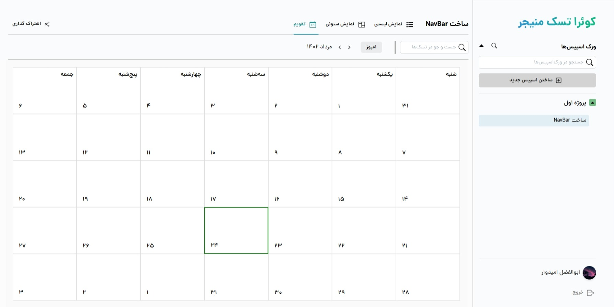

# TaskMaster - Innovative Task Management App


TaskMaster is an innovative task management app built as a part of the final project for the Front End Bootcamp course. This app is designed to help you stay organized and productive by efficiently managing your tasks, projects, and deadlines.

## Features

- **Intuitive Interface:** TaskMaster offers a user-friendly interface that simplifies task management, making it easy to create, update, and track tasks.

- **Advanced Task Management:** Utilize the power of Redux to manage state, ensuring seamless synchronization of data across components. Drag-and-drop tasks for easy reordering and prioritization using the DnD Kit.

- **Effortless Form Handling:** Thanks to React Hook Form, managing task details is hassle-free, with built-in validation and smooth error handling.

- **Sleek Design with Mantine UI Kit:** TaskMaster boasts a sleek and modern design using the Mantine UI Kit, making your task management experience visually appealing.

- **Custom Calendar System:** Experience a calendar system designed from scratch, offering a unique way to view tasks based on dates, without relying on any external dependencies.

## Screenshots

Here's a sneak peek at some of the screens from TaskMaster:


_Effortlessly manage and organize your tasks._



_Stay on top of deadlines with our custom calendar system._

## Getting Started

To get started with TaskMaster, follow these steps:

1. Clone this repository to your local machine using:

```bash
 git clone https://github.com/Quera-Spring-Front-end-Bootcamp/Group11.git
```

2. Navigate to the project directory:

3. Install the project dependencies:

```bash
npm install
```

4. Start the development server:

5. Open your browser and visit `http://localhost:3000` to see TaskMaster in action.

## Contribution Guidelines

We welcome contributions from the open-source community to make TaskMaster even better. If you'd like to contribute, please follow these steps:

1. Fork this repository.

2. Create a new branch with a descriptive name:

```bash
git checkout -b feature/my-amazing-feature
```

3. Make your changes and commit them with clear commit messages:

```bash
git commit -m "Add: Feature ABC"
```

4. Push your changes to your forked repository.

5. Create a pull request (PR) towards the `main` branch of this repository, detailing the changes you've made.

## Feedback

We value your feedback! If you encounter any issues, have suggestions for improvements, or want to share your experience, feel free to open an issue in this repository.

---

Designed and developed by NextTech Team at quera front end bootcamp:
_Abolfazl Omidvar._
_Saeed Firoozi._
_Mehdi Torkaman._

Let TaskMaster revolutionize the way you manage tasks and boost your productivity! 🚀
